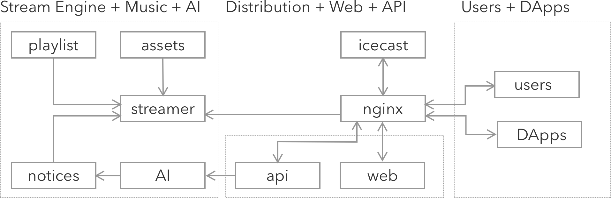

# RTME: Real-Time Music Exchange

The Real-Time Music Exchange (RTME) is a small demo that pioneers a fusion of Web3 technology, Artificial Intelligence (AI), and Live Internet Radio broadcasting, unveiling a new realm of accessibility and interactivity in broadcasting!

RTME empowers listeners to broadcast live messages through smart contracts, enhanced with speech generated by AI. It further shows how Web3 can revolutionize the broadcasting arena by enabling broadcasters to market airspace directly to anyone, globally, in a decentralized and permissionless manner.

Though a weekend project, RTME is now fully functional and live on [rtme.com](https://rtme.com), operating on a [smart contract](https://sepolia.etherscan.io/address/0x15C51C2AF7b6Da77f2CF0a0fa46D1f7869B8bf39#writeContract) on the Sepolia testnet. This small initiative aims to contribute the vast potential of Web3 in reshaping the musical and online cultural landscapes.

Looking ahead, the mechanisms developed in RTME lay the groundwork for a plethora of innovative  and transformative possibilities Web3+AI holds for both the musical realm and the broader digital cultural landscape. In the near future, users could leverage these mechanisms to vote on song selections, trade music, or provide direct patronage to artists sans intermediaries... the horizon is brimming with possibilities.

## Live demo

The system is live on https://rtme.com, where there is a test music stream running on short loop so that the user broadcasts can be played/demoed faster. 

To issue a notification, use the smart contract available on teh **Sepolia** testnet:

* [RTME Smart Contract](https://sepolia.etherscan.io/address/0x15C51C2AF7b6Da77f2CF0a0fa46D1f7869B8bf39#writeContract)

On this contract, anyone can issue a broadcast message using the __broadcast__ function. This function takes two parameters:

1. __payableAmount__ - this can be set to zero, but in the future this is how participants pay to broadcast their messages. This broadcast fee can be configured in the smart contract. 
2. __message__ - this is the message that will be broadcast live on the stream available on [rtme.com](https://rtme.com). 

After submitting a message to be broadcast, the backend picks up the broadcastRequest log message, and processes to use AI to perform Text-To-Speech (using Google's TTS). This is then scheduled on the live stream. 

It can take as low as ~10s to get a message out from smart contract to live stream. Sometimes it may take a bit longer since the current song/stream needs to complete before a new one is streamed.    

Once the requested broadcast is scheduled, the smart contract is updated with the time the broadcast was streamed!

## Architecture

RTME's architecture comprises a number of subsystems including: 

* __streamer__: this system is responsible for injecting assets and notices into the live stream. This stream is then injected into nginx's via the rtmp (real time messaging protocol). 

* __nginx__: the webserver is central to the entire operation of this system since it is responsible for: translating the rtmp stream into HLS and DASH; distributing both web assets and sound streams (hls, dash, and mp3 from icecast); and interfacing with the API. 

* __icecast2__: this system generates the mp3 stream to be served to clients on the frontend. This mp3 stream seems should be universally supported.

* __api__: this should be a simple flask app that implements a simple interface to inject notifications; manage playlist; etc. 

* __web__: this contains the frontend html/css/js that users will use to listen and interact with radio stream. This includes the necessary Web3 primitives.

* __AI__: this advanced system looks into the smart contract and translates text into human speech so that it can be broadcast live.

## Technologies used

This system employs a wide range of technologies including: 

* [scaffold-eth-2](https://github.com/scaffold-eth/scaffold-eth-2).
* [Google Web3 end-points](https://cloud.google.com/web3) to subscribe to logs and update streamed times.
* [Google's Cloud AI for Text-To-Speech](https://cloud.google.com/text-to-speech).

## Future extensions

In the future, this system can be extended to explore many other Web3 opportunities such as:

* Pay content creators directly.
* Allowing listeners to vote on what songs to play next, rate these songs.
* Create a marketplace for Music NFTs that when played accrue value to the owners/creators.
* Enable news, price, market feeds, or advertisers, to publish their sound messages directly. 
* ...

The possibilities are endless, and very much exciting! 💖
